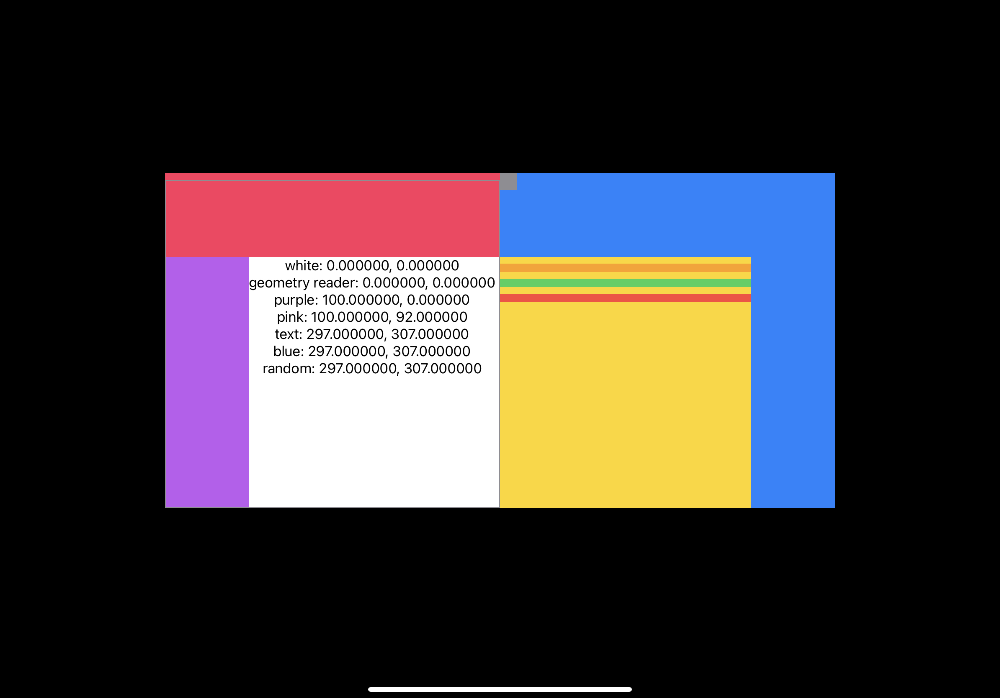

# 猎奇

SwiftUI中对coordinate space的设计相当猎奇。

与这个概念最紧密相关的是`View`的`coordianteSpace(name:)`方法。我们先看[文档][1]：

[1]: https://developer.apple.com/documentation/swiftui/view/coordinatespace(name:)

> Assigns a name to the view’s coordinate space, so other code can operate
> on dimensions like points and sizes relative to the named space.

好，看了这个文档之后我们都对这个东西有什么作用有所期待了。接着我们看看实际效果。

```swift
import SwiftUI

struct ContentView: View {
  var body: some View {
    HStack(spacing: 0) {
      // 左侧
      VStack {
        Spacer()
        VStack {
          Spacer()
          HStack {
            Spacer()
            VStack {
              GeometryReader {
                gp in
                VStack {
                  let originWhite = gp.frame(in: .named("white")).origin
                  Text(
                    "white: \(originWhite.x), \(originWhite.y)"
                  )
                  let originGeometryReader = gp.frame(in: .named("geometry reader")).origin
                  Text(
                    "geometry reader: \(originGeometryReader.x), \(originGeometryReader.y)"
                  )
                  let originPurple = gp.frame(in: .named("purple")).origin
                  Text(
                    "purple: \(originPurple.x), \(originPurple.y)"
                  )
                  let originPink = gp.frame(in: .named("pink")).origin
                  Text(
                    "pink: \(originPink.x), \(originPink.y)"
                  )
                  let originText = gp.frame(in: .named("text")).origin
                  Text(
                    "text: \(originText.x), \(originText.y)"
                  )
                  let originBlue = gp.frame(in: .named("blue")).origin
                  Text(
                    "blue: \(originBlue.x), \(originBlue.y)"
                  )
                  let originRandom = gp.frame(in: .named(UUID())).origin
                  Text(
                    "random: \(originRandom.x), \(originRandom.y)"
                  )
                }
                .coordinateSpace(name: "text")
              }
              .coordinateSpace(name: "geometry reader")
            }
            .foregroundColor(.black)
            .background(Color.white)
            .frame(width: 300, height: 300)
            .coordinateSpace(name: "white")
          }
          .background(Color.purple)
          .coordinateSpace(name: "purple")
        }
        .background(Color.pink)
        .border(Color.gray, width: 1)
        .coordinateSpace(name: "pink")
      }
      .background(Color.pink)
      .coordinateSpace(name: "pink")
      // 右侧
      VStack {
        VStack {
          HStack {
            Rectangle().foregroundColor(.gray)
              .frame(width: 20, height: 20)
              .onDrag {
                NSItemProvider(object: "some string" as NSString)
              }
            Spacer()
          }
          Spacer()
        }
        HStack {
          ScrollView {
            VStack {
              Spacer()
                .frame(height: 20)
              Rectangle()
                .foregroundColor(.orange)
                .onDrop(of: [.text], delegate: D(target: "orange"))
              Rectangle()
                .foregroundColor(.green)
                .onDrop(of: [.text], delegate: D(target: "green"))
                .coordinateSpace(name: "green")
              Rectangle()
                .foregroundColor(.red)
                .coordinateSpace(name: "red")
                .onDrop(of: [.text], delegate: D(target: "red"))
            }
          }
          .frame(width: 300, height: 300)
          .background(Color.yellow)
          Spacer()
        }
      }
      .background(Color.blue)
      .coordinateSpace(name: "blue")
    }
    .frame(width: 800, height: 400)
    .statusBar(hidden: true)
  }
}

struct D: DropDelegate {
  let target: String
  func dropExited(info: DropInfo) {
    print("exiting \(target), location: \(info.location)")
  }
  func dropEntered(info: DropInfo) {
    print("entering \(target), location: \(info.location)")
  }
  func performDrop(info: DropInfo) -> Bool {
    print("performing \(target), location: \(info.location)")
    return true
  }
}
```

将上面的`ContentView`作为唯一`View`的app在11寸的iPad Pro 2020上看起来是这样的：



看代码立刻就知道，白色方块里的那些字显示的是白色方块在不同的coordinate space中的位置。
前置知识（从`coordinateSpace(named:)`的文档中的举例总结出来的，算是有文档支撑吧）：coordinate
space中，一个`View`（甲）在另一个`View`（乙）的coordinate space中的`frame`的`origin`的`x`和`y`值
是甲的左上角的点在以乙的左上角为原点的坐标系中的x和y值，x为横坐标轴上的位置，此轴右为正；y为
纵坐标轴上的位置，此轴下为正。

首先是白色方块在`"white"` coordinate space，也就是它自己的coordinate space中的位置。
0，0。这恒河里。自己的左上角当然跟自己的左上角重合。

然后是`"geometry reader"`。`GeometryReader`填满白色方块，0，0还是河里。

接下来是白色方块在`"purple"` coordinate space中的位置。100，0也恒河里。看看代码做点数学
就知道白色区块的左上角确实在紫色区块左上角的右侧100点（point）处。

然后事情就开始猎奇起来了。

在决定`"pink"` coordinate space中的位置时。pink看上去也不粉。两个pink之中，SwiftUI基于某种
原因选择了里面的一个，因而y坐标不为100。

当coordinate space变成`"text"`之后，我们会期待显示的数字对应白色方块相对于其中
包含文字的`VStack`的位置。这个`VStack`的左上角应该跟白色方块的左上角重合才对，但我们得到的却
不是0，0，看着反而像是相对于屏幕左上角位置。

接着是相对蓝色方块（`"blue"`）。我们期待-300，100。反正我读了文档后如此期待。结果却与上面一样。

然后，是相对于一个不存在的coordinate space。嗯。没有报错，没有输出，没有崩溃。默默地给出了
与上面一样的答案。

要是在写复杂的app时碰到这种程序不崩溃的情况人就该崩溃了。显然是有个默认行为但是文档又没写默认行为
是什么，什么时候发生。

这时候就只能靠自己研究其规律了。只有用上科学的方法：观察、假设、检验。

难怪有人说苹果是设计之神。设计出来的SwiftUI明明是人造物却需要用研究自然的方法来研究。

过程隐去，直接发表研究结果。

**SwiftUI查找`.named`coordinate space的行为如下：从查找coordinate space的`View`（在这个场合中
是`GeometryReader`）或其亲`View`开始，确认其coordinate space是否符合用于查找的“name”。符合就直接使用。如果
不符合，就在其亲`View`中重复，依此循环。若始终找不到符合条件的，就使用以屏幕左上角为
原点的coordinate space。**

我们看到的奇景均与这个行为相符。为什么要加个“或其亲`View`”呢？看到后面就清楚了。

这个猎奇的coordinate space也造就了猎奇的拖拽。拖拽中与coordinate space相关的是`DropInfo.location`。
我们还是先看看[文档][2]：

[2]: https://developer.apple.com/documentation/swiftui/dropinfo/location

> The location of the drag in the coordinate space of the drop view.

谢谢苹果的谜语。

那么我们开拖。前述的app里灰色的方块可以拖拽，我们把它拖进橙色、绿色、红色的方块中看看打印出来的坐标。

首先是橙色。我们在橙色块上方加了一个`Spacer`。可以看出，虽然是橙色块调用的`onDrop`，`DropDelegate`使用
的coordinate space却并非以橙色左上角为原点。我们从橙色块上缘拖出拖进时，打印出的y坐标并非在0附近。
看来是使用了黄色区块，也就是`ScrollView`的coordinate space。

接着试试绿色。绿色区块与橙色区块的区别在于，在`onDrop`返回的`View`上调用了`coordinateSpace(name:)`。我们惊讶地
发现，这时`DropDelegate`使用的坐标系却与绿色区块相符了！我们再次观察假设检验，发现这这说明了SwiftUI另一猎奇的
行为：

`coordinateSpace(name:)`并不只是给一个`View`的coordinate space命名而已，它实际上同时“声明”了，这
个`View`的coordinate space“重要”。**一部分API在查找应当使用的coordinate space时只会将“重要”的coordinate
space纳入考虑。**

这个说法不全对，不对的部分没有加粗。后面有取代不对的部分的更正确的说法。

再考虑橙色块中的行为，我们又看出：

**`ScrollView`自带一个“重要”的coordinate space。**

毕竟我们没有调用`ScrollView`的`coordinateSpace(name:)`。有没有其它`View`也是如此呢？我就不知道了。

最后我们再试试红色块。红色块与绿色块的区别在于，调用`onDrop`和`coordinateSpace(name:)`的顺序不一样。可以看出，红色
块的拖拽与橙色块的拖拽使用的coordinate space是一样的，都是`ScrollView`的coordinate space。我自然不知道SwiftUI的View
Modifier都是如何实现的，但是从这里我们可以大胆猜想，

**恐怕每个View Modifier返回的都是一个将其调用者作为子`View`的`View`。**

并且

**`coordinateSpace(name:)`并非为调用其的`View`的coordinate space命名并“声明”“重要”，而是返回一个有着有名字而“重要”
的coordinate space的，将其调用者作为唯一子`View`并且与其位置、大小相同的`View`。不由这个方法返回的`View`大多
没有“重要”的coordinate space，但也有例外，比如前述的`ScrollView`。**

而

**SwiftUI在查找“重要”的coordinate space时的行为与它查找`.named`时的行为类似：从查找coordinate space的`View`或其
亲`View`开始，确认其coordinate space是否“重要”。若其不重要，则再在其亲`View`中查找，依此循环。**

若始终找不到，怕还是会把屏幕左上角当原点吧，只是我懒得试了。

所以，对绿色区块的`onDrop`返回的`View`而言，`coordinateSpace(name: "green")`返回的`View`是其亲`View`，这个亲`View`有着
名为`"green"`的“重要”coordinate space，拖拽时要将其纳入考虑。而对红色区块的`onDrop`返回的`View`而言，有着“重要”
的`"red"`coordinate space的那个`View`是它的子`View`，根本不在查找coordinate space的路线之内。
